# How To Win Capitalism - Architecture Analysis

> **Generated:** 2025-12-12
> **Purpose:** Comprehensive technical analysis of the codebase architecture, data flows, and design patterns.

## Table of Contents

1. [Executive Summary](#executive-summary)
2. [High-Level System Architecture](#high-level-system-architecture)
3. [Technology Stack](#technology-stack)
4. [Component Architecture](#component-architecture)
5. [Data Schema & Storage](#data-schema--storage)
6. [Authentication System](#authentication-system)
7. [CRUD & I/O Operations](#crud--io-operations)
8. [Request/Response Lifecycle](#requestresponse-lifecycle)
9. [Design Patterns Employed](#design-patterns-employed)
10. [Content Management System](#content-management-system)
11. [Deployment Architecture](#deployment-architecture)
12. [Key Observations](#key-observations)

---

## Executive Summary

**How To Win Capitalism** is a Wikipedia-style financial literacy wiki built with a hybrid SSR architecture. The system combines:

- **Astro v5** with SSR output mode for dynamic content
- **Cloudflare Pages** for edge hosting with Workers runtime
- **Cloudflare KV** for persistent storage (users, sessions)
- **MDX content** for wiki articles
- **Nanostores** for client-side state management

The codebase follows **Atomic Design** principles for components and uses a **dual auth system** (server-side KV auth + client-side store for UI state).

---

## High-Level System Architecture

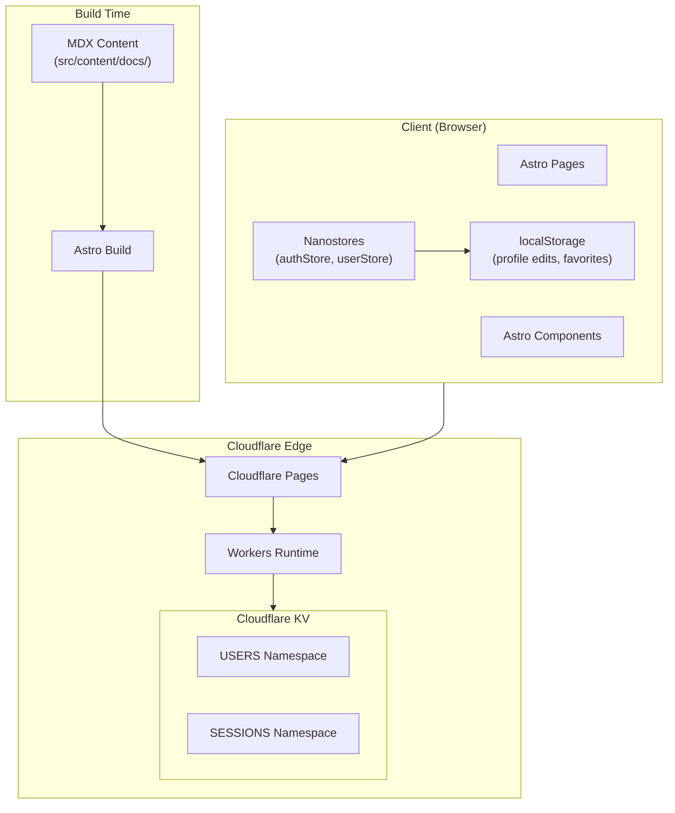

---

## Technology Stack

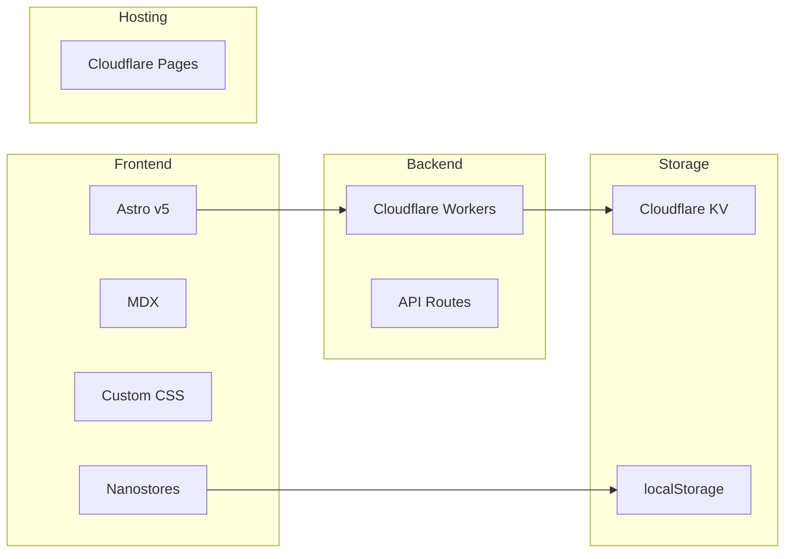

| Layer | Technology | Purpose |
|-------|------------|---------|
| **Framework** | Astro v5 | Static + SSR hybrid |
| **Content** | MDX | Wiki articles with components |
| **Styling** | Custom CSS | Wikipedia aesthetic |
| **State** | Nanostores + @nanostores/persistent | Client-side reactive state |
| **Auth** | Cloudflare KV + httpOnly cookies | Server-side sessions |
| **Hosting** | Cloudflare Pages | Edge deployment |
| **Runtime** | Cloudflare Workers | SSR + API routes |

---

## Component Architecture

The codebase follows **Atomic Design** principles:

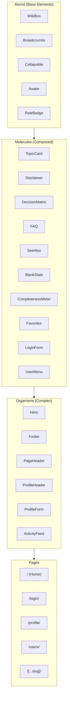

### Component Registry (`src/components/index.ts`)

| Category | Components |
|----------|------------|
| **Atoms** | WikiBox, Breadcrumbs, Collapsible, Avatar, RoleBadge |
| **Molecules** | TopicCard, Disclaimer, DecisionMatrix, FAQ, SeeAlso, BlankSlate, CompletenessMeter, Favorites, LoginForm, UserMenu, ActivityItem |
| **Organisms** | Hero, Footer, PageHeader, ProfileHeader, ProfileForm, ActivityFeed, SystemBulletin |
| **Utilities** | CardGrid, Empty, ForceLightTheme |
| **Guards** | OwnerGuard |

---

## Data Schema & Storage

### Cloudflare KV Schema

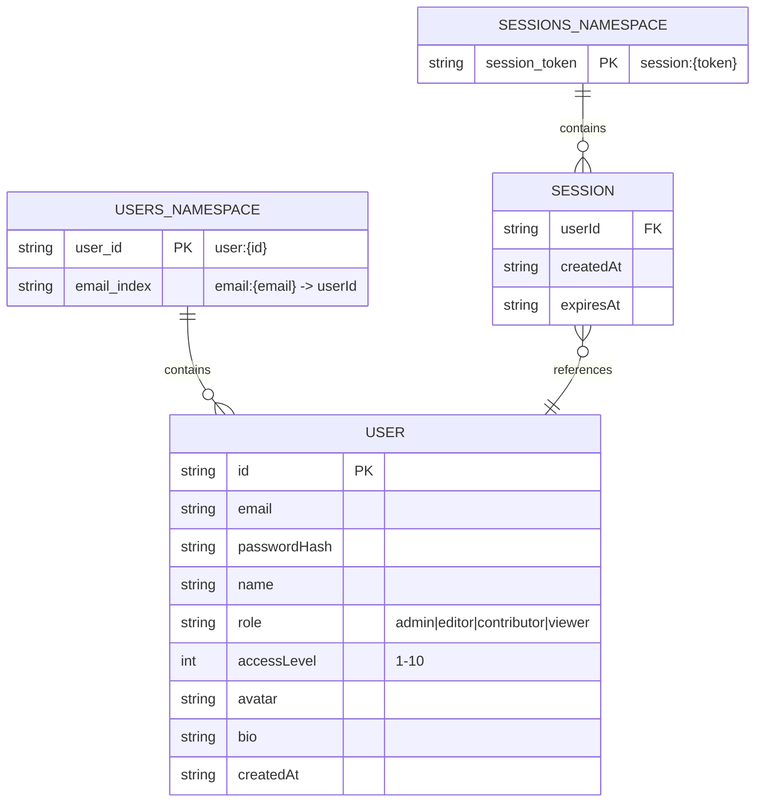

### Client-Side Storage (localStorage)

| Key | Purpose | Structure |
|-----|---------|-----------|
| `auth:*` | Auth state via nanostores | `{isLoggedIn, userId, userName, userRole, ...}` |
| `users_data` | Profile edits | `{userId: {name, avatar, bio}}` |
| `page_visits` | Activity tracking | `{path: timestamp}[]` |
| `favorites` | Bookmarked pages | `string[]` |
| `dismissed_disclaimer` | UI state | `boolean` |

### User Role Schema (RBAC)

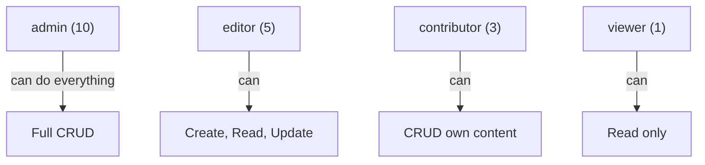

| Role | Access Level | Capabilities |
|------|--------------|--------------|
| **admin** | 10 | Full CRUD on all resources |
| **editor** | 5 | Create, Read, Update any (no delete) |
| **contributor** | 3 | CRUD on own content only |
| **viewer** | 1 | Read public content |

---

## Authentication System

### Dual Auth Architecture

The system has **two authentication layers**:

1. **Server-side (Cloudflare KV)** - Real auth with httpOnly cookies
2. **Client-side (Nanostores)** - UI state management

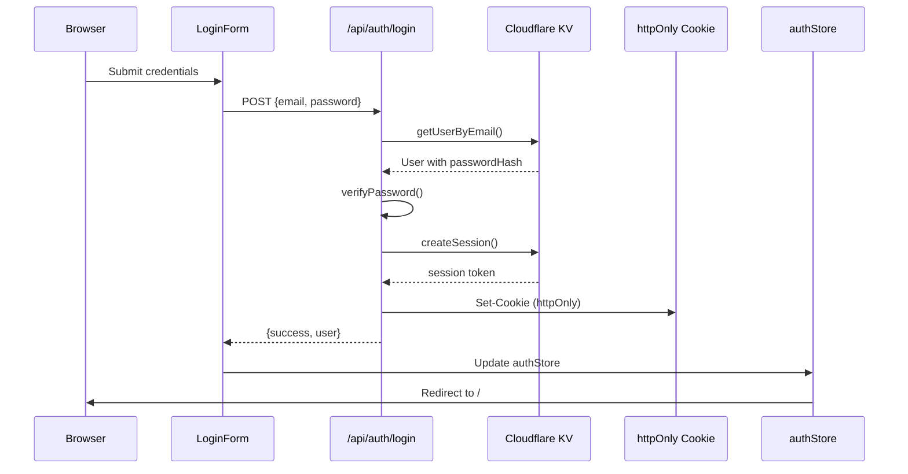

### Auth Flow Details

```mermaid
flowchart TB
    subgraph Login["Login Flow"]
        L1[User submits form] --> L2[POST /api/auth/login]
        L2 --> L3{Valid credentials?}
        L3 -->|Yes| L4[Create session in KV]
        L3 -->|No| L5[Return 401]
        L4 --> L6[Set httpOnly cookie]
        L6 --> L7[Return user data]
        L7 --> L8[Update client authStore]
    end

    subgraph Protected["Protected Request"]
        P1[Request to page] --> P2[Cookie sent automatically]
        P2 --> P3[Parse session token]
        P3 --> P4[Lookup in KV]
        P4 --> P5{Session valid?}
        P5 -->|Yes| P6[Get user from KV]
        P5 -->|No| P7[Redirect to /login/]
        P6 --> P8[Render page with user context]
    end

    subgraph Logout["Logout Flow"]
        O1[Click logout] --> O2[POST /api/auth/logout]
        O2 --> O3[Delete session from KV]
        O3 --> O4[Clear cookie]
        O4 --> O5[Clear authStore]
        O5 --> O6[Redirect to /login/]
    end
```

### Session Security Features

| Feature | Implementation |
|---------|----------------|
| **Password hashing** | SHA-256 with salt |
| **Session tokens** | 32-byte cryptographic random |
| **Cookie security** | httpOnly, Secure, SameSite=Strict |
| **Session expiry** | 7-day TTL in KV |
| **XSS protection** | No secrets in JavaScript |

---

## CRUD & I/O Operations

### Read Operations

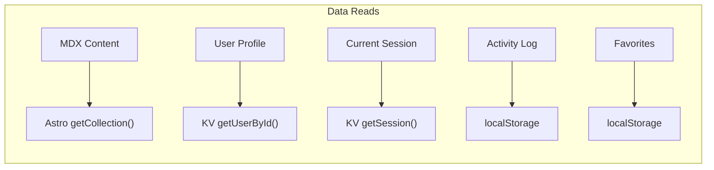

| Operation | Source | Method |
|-----------|--------|--------|
| Wiki content | `src/content/docs/*.mdx` | Astro `getCollection('docs')` |
| User by ID | KV USERS | `getUserById(users, id)` |
| User by email | KV USERS | `getUserByEmail(users, email)` |
| Session | KV SESSIONS | `getSession(sessions, token)` |
| Current user | KV + Cookie | `getCurrentUser(users, sessions, cookie)` |
| Page visits | localStorage | `activityStore.get()` |
| Favorites | localStorage | `favoritesStore.get()` |

### Write Operations

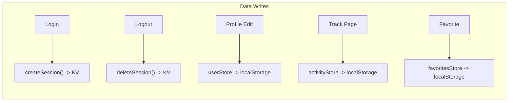

| Operation | Target | Method |
|-----------|--------|--------|
| Create session | KV SESSIONS | `createSession(sessions, userId)` |
| Delete session | KV SESSIONS | `deleteSession(sessions, token)` |
| Update profile | localStorage | `updateUserProfile(userId, updates)` |
| Track activity | localStorage | `trackActivity(type, path)` |
| Toggle favorite | localStorage | `toggleFavorite(path)` |

### API Endpoints

| Endpoint | Method | Purpose | I/O |
|----------|--------|---------|-----|
| `/api/auth/login` | POST | Authenticate user | Read KV, Write KV, Set Cookie |
| `/api/auth/logout` | POST | End session | Delete KV, Clear Cookie |
| `/api/auth/me` | GET | Get current user | Read Cookie, Read KV |

---

## Request/Response Lifecycle

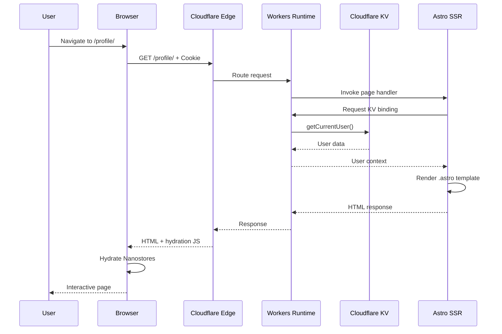

---

## Design Patterns Employed

### 1. Atomic Design Pattern

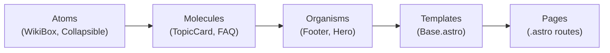

**Location:** `src/components/atoms/`, `molecules/`, `organisms/`

### 2. Repository Pattern (KV Auth)

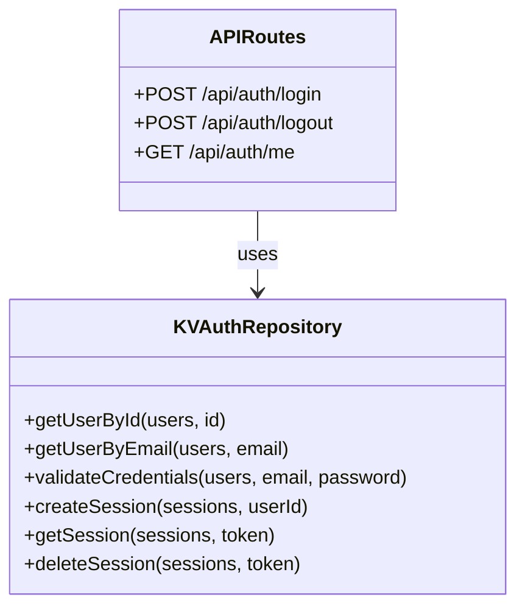

**Location:** `src/lib/auth/kv-auth.ts`

### 3. Observer Pattern (Nanostores)

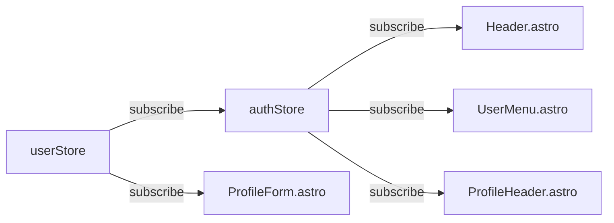

**Location:** `src/lib/auth/store.ts`, `src/lib/auth/userStore.ts`

### 4. Strategy Pattern (Decision Matrix)

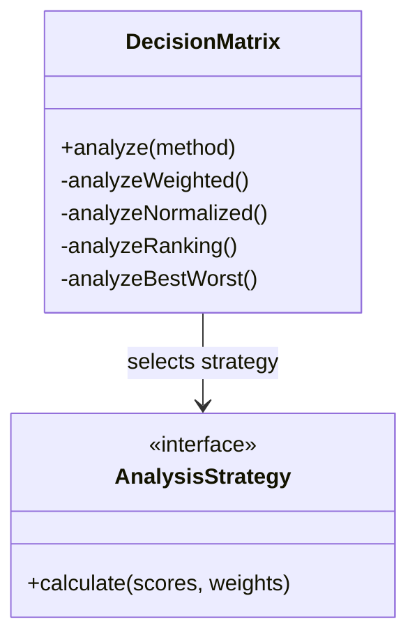

**Location:** `src/lib/tools/decision-matrix.ts`

### 5. Adapter Pattern (Starlight Customization)

The codebase adapts Starlight's documentation theme for a Wikipedia-style wiki:

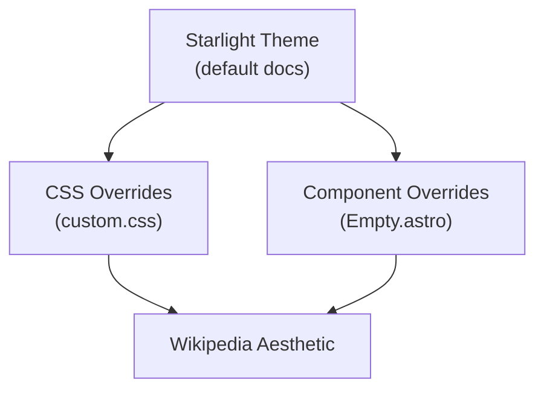

**Location:** `src/styles/custom.css`, `src/components/utilities/Empty.astro`

### 6. Facade Pattern (Auth Module)

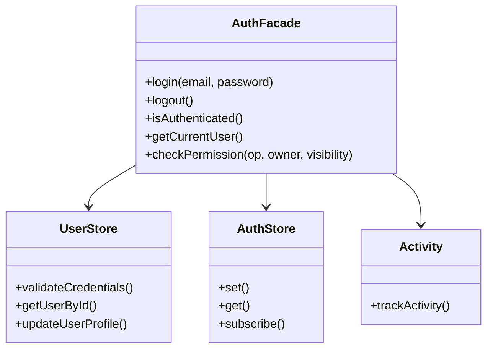

**Location:** `src/lib/auth/index.ts`

### 7. Singleton Pattern (Debug Logger)

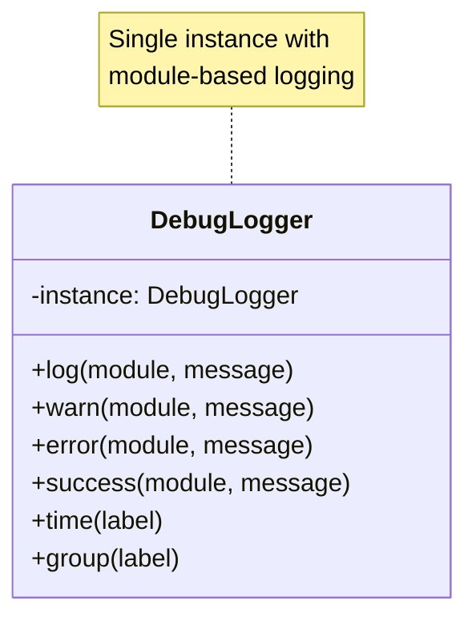

**Location:** `src/lib/debug.ts`

### 8. Guard Pattern (Route Protection)

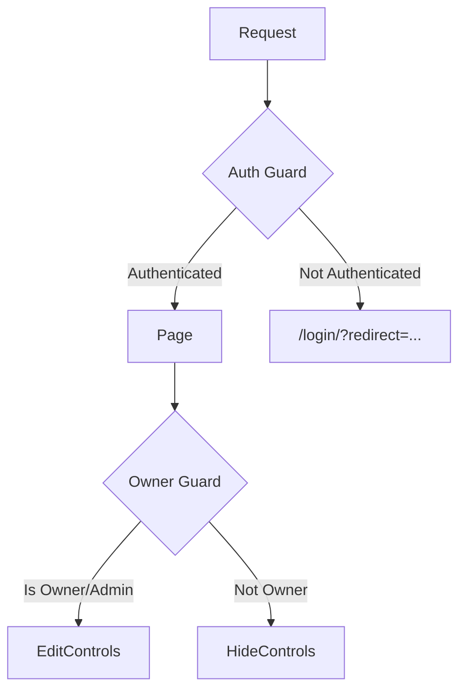

**Location:** `src/components/guards/OwnerGuard.astro`

---

## Content Management System

### Content Structure

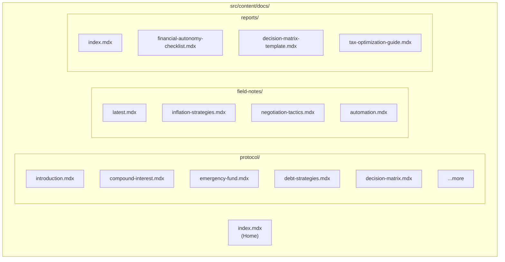

### Frontmatter Schema

```typescript
// src/content.config.ts
extend: z.object({
  category: z.enum(['concept', 'tool', 'framework', 'guide', 'reference']).optional(),
  difficulty: z.enum(['beginner', 'intermediate', 'advanced']).optional(),
  readTime: z.string().optional(),
})
```

---

## Deployment Architecture

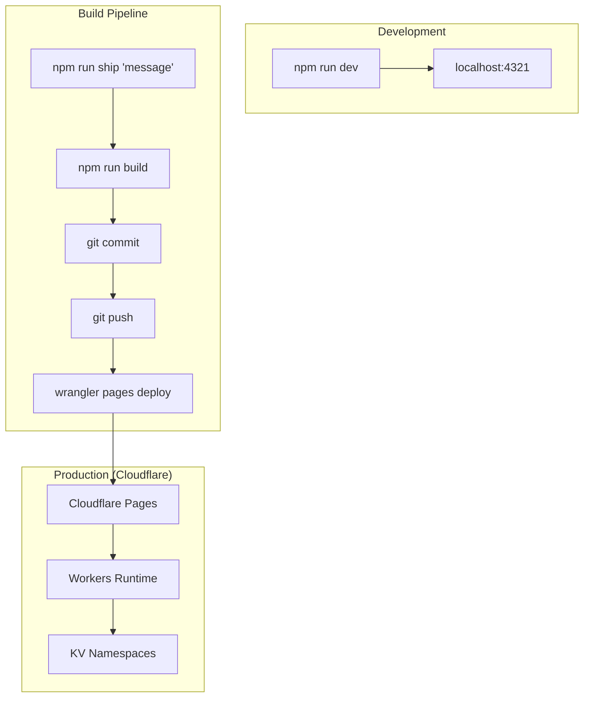

### Environment Configuration

| File | Purpose |
|------|---------|
| `astro.config.mjs` | Astro + integrations config |
| `wrangler.toml` | Cloudflare Pages + KV bindings |
| `public/_headers` | Security headers |
| `public/_redirects` | URL redirects |

---

## Key Observations

### Strengths

1. **Edge-first Architecture** - KV + Workers provide fast, globally distributed auth
2. **Clean Separation** - Server auth (KV) vs UI state (Nanostores) clearly separated
3. **Atomic Design** - Components are well-organized and reusable
4. **Comprehensive Logging** - Debug module with module-scoped, toggleable logging
5. **Type Safety** - TypeScript throughout with proper interfaces

### Areas of Interest

1. **Dual Auth System** - Both `kv-auth.ts` (server) and `userStore.ts` (client) exist
   - KV auth is the "real" system for production
   - Client stores provide fallback for local dev and UI state

2. **Password Storage** - Default passwords in `userStore.ts` for dev/demo
   - Production uses hashed passwords in KV

3. **RBAC Implementation** - Access levels (1-10) with role-based gates
   - UI-only protection via `OwnerGuard.astro`
   - Server protection via API route validation

4. **Content-Auth Bridge** - User IDs match between auth system and content collections
   - Enables future per-user content ownership

### Data Flow Summary

```
┌──────────────────────────────────────────────────────────────────────┐
│                         DATA FLOW                                     │
├──────────────────────────────────────────────────────────────────────┤
│                                                                      │
│  [Browser]                                                           │
│     ↓ POST /api/auth/login {email, password}                        │
│  [Cloudflare Worker]                                                 │
│     ↓ validateCredentials(USERS_KV, email, password)                │
│  [KV: USERS]                                                         │
│     ↓ user data (hashed password verified)                          │
│  [Cloudflare Worker]                                                 │
│     ↓ createSession(SESSIONS_KV, userId)                            │
│  [KV: SESSIONS]                                                      │
│     ↓ session token                                                 │
│  [Cloudflare Worker]                                                 │
│     ↓ Set-Cookie: htwc_session=token; HttpOnly; Secure              │
│  [Browser]                                                           │
│     ↓ authStore.set({isLoggedIn: 'true', ...})                      │
│  [localStorage]                                                      │
│     ↓ persist auth state                                            │
│  [UI]                                                                │
│     ↓ render authenticated view                                     │
│                                                                      │
└──────────────────────────────────────────────────────────────────────┘
```

---

## File Reference

| Path | Purpose |
|------|---------|
| `src/lib/auth/kv-auth.ts` | Server-side KV auth utilities |
| `src/lib/auth/store.ts` | Client-side auth state (nanostores) |
| `src/lib/auth/userStore.ts` | Unified user data store |
| `src/lib/auth/permissions.ts` | RBAC permission checks |
| `src/lib/auth/activity.ts` | Activity tracking |
| `src/lib/auth/api-client.ts` | Client-side API wrapper |
| `src/pages/api/auth/*.ts` | API route handlers |
| `src/lib/tools/decision-matrix.ts` | Decision matrix utility |
| `src/lib/debug.ts` | Debug logging system |
| `src/lib/constants.ts` | App constants |

---

*Document generated as part of codebase architecture review.*
