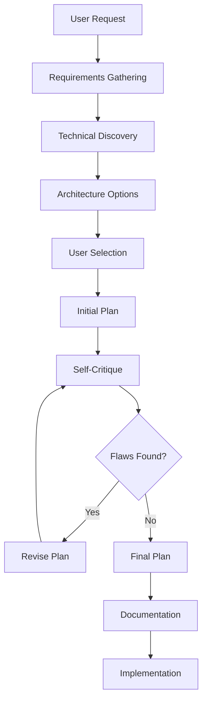

# Component Planning Process

## Document Information

| Field | Value |
|-------|-------|
| Document ID | CPP-001 |
| Version | 1.0.0 |
| Created | 2025-12-13 |
| Component | TradeWidget |
| Status | Approved |

---

## Table of Contents

1. [Purpose](#1-purpose)
2. [Process Overview](#2-process-overview)
3. [Phase I: Requirements Gathering](#3-phase-i-requirements-gathering)
4. [Phase II: Technical Discovery](#4-phase-ii-technical-discovery)
5. [Phase III: Architecture Selection](#5-phase-iii-architecture-selection)
6. [Phase IV: Plan Formulation](#6-phase-iv-plan-formulation)
7. [Phase V: Critical Review](#7-phase-v-critical-review)
8. [Phase VI: Plan Revision](#8-phase-vi-plan-revision)
9. [Phase VII: Final Approval](#9-phase-vii-final-approval)
10. [Appendix A: Prompt Sequence](#appendix-a-prompt-sequence)
11. [Appendix B: Decision Log](#appendix-b-decision-log)

---

## 1. Purpose

### 1.1 Scope

This document describes the exact process used to plan and design the TradeWidget component, from initial concept to approved implementation plan.

### 1.2 Intent

To establish a repeatable, documented process for component planning that:

- (a) Captures user requirements accurately
- (b) Explores technical constraints thoroughly
- (c) Produces minimal viable implementations
- (d) Self-critiques to avoid over-engineering
- (e) Results in actionable, approved plans

### 1.3 Applicability

This process applies to any new component, feature, or system that requires:

- (a) Multiple implementation approaches
- (b) External dependencies or services
- (c) Cross-site or cross-platform functionality
- (d) Security considerations

---

## 2. Process Overview

### 2.1 Process Diagram

### 2.2 Phase Summary

| Phase | Name | Purpose | Output |
|-------|------|---------|--------|
| I | Requirements Gathering | Understand what user wants | Requirements list |
| II | Technical Discovery | Understand existing codebase | Technical constraints |
| III | Architecture Selection | Present options, get decision | Chosen approach |
| IV | Plan Formulation | Create detailed plan | Initial plan document |
| V | Critical Review | Harshly critique own plan | List of flaws |
| VI | Plan Revision | Address flaws | Revised plan |
| VII | Final Approval | User confirms plan | Approved plan |

---

## 3. Phase I: Requirements Gathering

### 3.1 Initial Request Analysis

#### 3.1.1 User's Original Statement

> "I need a component that is completely independent from all other components as much as possible. I need it to work by allowing people to offer me something to trade for what I have to offer. Remember the One Red Paperclip guy? I want to do that, but I want to do it by offering something for trade at all times and having that item linked through this component anywhere I put it, and have ALL components update in real time across any and all sites they are on when I update what I have for trade."

#### 3.1.2 Extracted Requirements

| ID | Requirement | Priority |
|----|-------------|----------|
| R-001 | Component independence | High |
| R-002 | Accept trade offers | High |
| R-003 | Single source of truth | High |
| R-004 | Real-time sync across sites | High |
| R-005 | Embeddable anywhere | Medium |
| R-006 | Multiple display modes | Medium |

### 3.2 Clarifying Questions

The following questions were asked to refine requirements:

#### 3.2.1 Display Configuration

**Question:** What data should be displayed?

**Options Presented:**
- Item name (required)
- Description (optional)
- Image (optional)
- Trade history (optional)

**User Decision:** All of the above.

#### 3.2.2 Offer Collection

**Question:** What data to collect from people making offers?

**User Decision:** Their offer description + their email.

#### 3.2.3 Notification Method

**Question:** How to be notified of offers?

**User Decision:** Email (via existing Resend setup initially, later simplified).

#### 3.2.4 Display Modes

**Question:** How should the widget be displayed?

**User Decision:** Three modes - banner, floating, inline.

---

## 4. Phase II: Technical Discovery

### 4.1 Codebase Analysis

The following files were examined to understand existing patterns:

| File | Purpose | Findings |
|------|---------|----------|
| `package.json` | Dependencies | Astro 5.x, Cloudflare, nanostores, Resend |
| `src/components/index.ts` | Component registry | Atomic design pattern |
| `src/components/atoms/WikiBox.astro` | Base component | BEM naming, CSS variables |
| `src/components/molecules/CallToAction.astro` | Similar component | URL sanitization pattern |
| `src/lib/constants.ts` | Site constants | Configuration pattern |

### 4.2 Technical Constraints Identified

| Constraint | Source | Impact |
|------------|--------|--------|
| No React/Vue/Svelte | .cursorrules | Use vanilla JS or Web Components |
| Use CSS variables | .cursorrules | Must use --color-* variables |
| Cloudflare hosting | package.json | Can use KV, Workers |
| Existing Turnstile | codebase | Bot protection available |
| Existing Resend | codebase | Email capability available |

---

## 5. Phase III: Architecture Selection

### 5.1 Options Presented

#### 5.1.1 Option A: Cloudflare KV Backend

- Store data in Cloudflare KV
- API routes serve data
- Admin panel for updates

**Pros:** Uses existing infrastructure
**Cons:** Ties to this site as source of truth

#### 5.1.2 Option B: External Service (Firebase/Supabase)

- Store data in external database
- Real-time sync built-in
- Truly independent

**Pros:** Decoupled, real-time
**Cons:** External dependency, may cost money

#### 5.1.3 Option C: Static JSON + Polling

- JSON file hosted somewhere
- Widgets poll periodically

**Pros:** Simple, no backend
**Cons:** Not truly real-time

#### 5.1.4 Option D: Mailto Only (Dumbest)

- Hardcoded data in component
- Mailto link for offers

**Pros:** Zero attack surface
**Cons:** No sync across sites

### 5.2 User Decisions

#### 5.2.1 Security Priority

User stated: "I don't know enough about security to design this all myself from scratch and not get fucked by the Internet. Can we keep it as simple and dummy proof as possible?"

**Decision:** Prioritize simplicity and security over features.

#### 5.2.2 Simplicity Priority

User stated: "Let's do the absolute dumbest possible version of this that's also super fucking safe locked in secure."

**Decision:** Mailto-based offers, no stored data.

#### 5.2.3 Sync Requirement Revisited

User stated: "Option A - a hosted JSON file should do the trick... shouldn't I be able to host resources like that in a public github repo?"

**Decision:** GitHub-hosted JSON as single source of truth.

#### 5.2.4 Repository Naming

User stated: "Let's make the repo something that can grow over time... name it something better so that I can put more resources like this in it over time."

**Decision:** Repository named `open-shelf`.

---

## 6. Phase IV: Plan Formulation

### 6.1 Initial Plan (Over-Engineered)

The first plan included:

- 5 files (trade-data.ts, TradeWidget.astro, TradeHistory.astro, TradeOffer.astro, index.ts)
- TypeScript interfaces
- 3 display modes
- Sub-components
- Email obfuscation

### 6.2 Plan Document Created

A formal plan document was created at:
`.cursor/plans/trade_widget_component_b150735e.plan.md`

---

## 7. Phase V: Critical Review

### 7.1 Self-Critique Requested

User stated: "Now harshly criticize your plan. Disprove yourself if you can."

### 7.2 Flaws Identified

| Flaw ID | Description | Severity |
|---------|-------------|----------|
| F-001 | Over-engineered for "dumbest possible" request | High |
| F-002 | 5 files when 1 would suffice | Medium |
| F-003 | TypeScript interfaces for simple data | Low |
| F-004 | Email obfuscation is security theater | Low |
| F-005 | Trade history useless for Trade #1 | Low |
| F-006 | 3 display modes is scope creep for MVP | Medium |

### 7.3 Second Critique (After First Revision)

User stated: "Now criticize this NEW plan just as harshly. Does it align with my original and revised goals?"

### 7.4 Critical Flaw Discovered

| Flaw ID | Description | Severity |
|---------|-------------|----------|
| F-007 | Hardcoded data abandons original goal of cross-site sync | Critical |

**Analysis:** The revised "dumb" plan with hardcoded data violated the user's core requirement: "have ALL components update in real time across any and all sites."

---

## 8. Phase VI: Plan Revision

### 8.1 Revision Trigger

User recognized the tradeoff and chose:

> "Option A - a hosted JSON file should do the trick."

### 8.2 Final Architecture Selected

| Component | Implementation |
|-----------|----------------|
| Data source | GitHub raw file (ctavolazzi/open-shelf) |
| Widget | Astro + Web Component with fetch() |
| Offers | Mailto link to porchroot@gmail.com |
| Display modes | inline, banner (floating deferred) |

### 8.3 Revised Plan

Plan document updated with:
- GitHub-based architecture
- Mermaid diagrams (3 diagrams)
- Simplified file structure (1 widget file)
- Clear update workflow

---

## 9. Phase VII: Final Approval

### 9.1 User Approval

User switched to Agent mode, signaling approval to proceed with implementation.

### 9.2 Final Deliverables

| Deliverable | Location |
|-------------|----------|
| Plan document | `.cursor/plans/trade_widget_component_b150735e.plan.md` |
| GitHub repo | `ctavolazzi/open-shelf` (to be created) |
| Widget component | `src/components/trade/TradeWidget.astro` (to be created) |
| Architecture docs | `_docs/` (to be created) |

---

## Appendix A: Prompt Sequence

The following prompts were exchanged during this planning process:

### A.1 Requirements Phase

| # | Role | Prompt Summary |
|---|------|----------------|
| 1 | User | Initial request describing One Red Paperclip concept |
| 2 | AI | Echo back understanding, ask clarifying questions |
| 3 | User | Confirms understanding, asks what info is needed |
| 4 | AI | Lists 5 questions (display data, offers, notification, admin, real-time) |
| 5 | User | Concerned about being source of truth |
| 6 | AI | Explains decoupling options |
| 7 | User | Asks for simple and secure approach |

### A.2 Architecture Phase

| # | Role | Prompt Summary |
|---|------|----------------|
| 8 | AI | Presents "dumbest secure" architecture |
| 9 | User | Asks final 3 questions |
| 10 | User | Answers: yes history, yes photos, porchroot@gmail.com |
| 11 | User | Requests 3 display modes |
| 12 | AI | Presents implementation plan |

### A.3 Critique Phase

| # | Role | Prompt Summary |
|---|------|----------------|
| 13 | User | "Now harshly criticize your plan" |
| 14 | AI | Lists 7 flaws, proposes simpler version |
| 15 | User | "Revise your plan" |
| 16 | AI | Creates minimal 1-file plan |
| 17 | User | "Now criticize this NEW plan" |
| 18 | AI | Identifies critical flaw (abandoned sync requirement) |

### A.4 Resolution Phase

| # | Role | Prompt Summary |
|---|------|----------------|
| 19 | User | Chooses GitHub-hosted JSON approach |
| 20 | User | Names repo "open-shelf" |
| 21 | AI | Updates plan with GitHub architecture |
| 22 | User | Requests architecture diagrams |
| 23 | AI | Adds 3 mermaid diagrams |
| 24 | User | Approves, switches to Agent mode |

---

## Appendix B: Decision Log

| Decision ID | Decision | Rationale | Alternatives Rejected |
|-------------|----------|-----------|----------------------|
| D-001 | Use mailto for offers | Zero attack surface | Form + Resend (more complex) |
| D-002 | GitHub raw file for data | Free, reliable, user already has GitHub | Cloudflare KV (ties to one site), Firebase (external dep) |
| D-003 | Web Component for fetch | Works in Astro, vanilla JS | Nanostores (overkill), server-side fetch (no client update) |
| D-004 | Defer floating mode | Requires JS toggle logic, not MVP | Build all 3 modes upfront |
| D-005 | No image support initially | User doesn't have photo ready | Require image (blocks launch) |
| D-006 | porchroot@gmail.com | User's choice, Gmail spam filter sufficient | Alias service (more setup) |
| D-007 | Name repo "open-shelf" | Allows future growth (books, etc.) | "trade-data" (too specific) |

---

## Document History

| Version | Date | Author | Changes |
|---------|------|--------|---------|
| 1.0.0 | 2025-12-13 | AI + User | Initial document |
