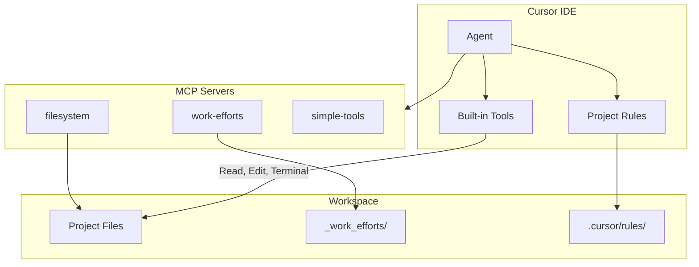

# Cursor IDE Reference Guide

> Generated: December 14, 2025
> Based on investigation of `~/.cursor/` folder structure

## Overview

Cursor stores configuration, state, and tracking data in `~/.cursor/` (global) and project-specific folders. This guide documents the structure and how to leverage it.

---

## Global Folder Structure (`~/.cursor/`)

```
~/.cursor/
├── ai-tracking/           # AI code generation tracking
│   └── ai-code-tracking.db  # SQLite database
├── argv.json              # VS Code CLI arguments
├── browser-logs/          # Accessibility snapshots from browser tool
├── cli-config.json        # Cursor CLI settings
├── extensions/            # VS Code extensions
├── ide_state.json         # Recently viewed files, state
├── mcp.json               # Global MCP server config
├── plans/                 # Plan files from CreatePlan tool
├── projects/              # Per-project configurations
└── worktrees/             # Git worktree support
```

---

## Key Files Explained

### 1. AI Code Tracking (`ai-tracking/ai-code-tracking.db`)

SQLite database tracking all AI-generated code.

**Schema:**
```sql
ai_code_hashes (hash, source, fileExtension, fileName,
                requestId, conversationId, timestamp, createdAt)
scored_commits (commitHash, branchName, scoredAt)
tracking_state (key, value)
```

**Useful Queries:**
```bash
# Count AI-generated code by file type
sqlite3 ~/.cursor/ai-tracking/ai-code-tracking.db \
  "SELECT fileExtension, COUNT(*) FROM ai_code_hashes GROUP BY fileExtension ORDER BY 2 DESC;"

# AI activity by day
sqlite3 ~/.cursor/ai-tracking/ai-code-tracking.db \
  "SELECT date(createdAt/1000, 'unixepoch'), COUNT(*) FROM ai_code_hashes GROUP BY 1 ORDER BY 1 DESC LIMIT 14;"

# Most AI-assisted files
sqlite3 ~/.cursor/ai-tracking/ai-code-tracking.db \
  "SELECT fileName, COUNT(*) FROM ai_code_hashes WHERE fileName IS NOT NULL GROUP BY 1 ORDER BY 2 DESC LIMIT 15;"
```

### 2. CLI Configuration (`cli-config.json`)

Controls Cursor CLI behavior and permissions.

**Current Settings:**
```json
{
  "editor": { "vimMode": false },
  "permissions": { "allow": ["Shell(ls)"], "deny": [] },
  "approvalMode": "allowlist",
  "sandbox": { "mode": "disabled" }
}
```

**Options:**
| Setting | Purpose |
|---------|---------|
| `vimMode` | Enable Vim keybindings |
| `permissions.allow` | Allowlist for tool execution |
| `permissions.deny` | Denylist for tool execution |
| `approvalMode` | How tool calls are approved |
| `sandbox.mode` | Sandboxing for AI operations |

### 3. Plans Directory (`plans/`)

Stores plan files created by the CreatePlan tool.

**Format:**
```yaml
---
name: Plan Name
overview: "Brief description"
todos:
  - id: task-id
    content: Task description
    status: pending|in_progress|completed
---
# Markdown content with detailed plan
```

**Access saved plans:**
```bash
ls ~/.cursor/plans/
```

### 4. MCP Configuration (`mcp.json`)

Configure Model Context Protocol servers.

**Global config:** `~/.cursor/mcp.json`
**Project config:** `<project>/.cursor/mcp.json`

**Example:**
```json
{
  "mcpServers": {
    "filesystem": {
      "command": "npx",
      "args": ["-y", "@modelcontextprotocol/server-filesystem", "${workspaceFolder}"]
    }
  }
}
```

---

## Project-Specific Data (`~/.cursor/projects/<project-name>/`)

Each project gets its own folder named by path (slashes replaced with dashes).

```
projects/Users-ctavolazzi-Code-howtowincapitalism/
├── agent-tools/           # Cached tool outputs
├── agent-transcripts/     # Full conversation logs (JSON + TXT)
├── assets/                # Images pasted into conversations
├── mcp-cache.json         # MCP server cache
└── terminals/             # Terminal state files
```

### Agent Transcripts

Full conversation history including:
- User messages with context
- AI thinking/reasoning
- Tool calls and results

**Format:** JSON array of role/text objects.

**Location:**
```bash
ls ~/.cursor/projects/*/agent-transcripts/
```

---

## AI Tracking Statistics (This Project)

As of December 14, 2025:

| Metric | Value |
|--------|-------|
| Total code hashes | 9,040 |
| Conversations tracked | 12 |
| Date range | Dec 11-14, 2025 |

**By file type:**
| Extension | Count |
|-----------|-------|
| `.md` | 4,427 |
| `.ts` | 2,289 |
| `.astro` | 2,031 |
| `.mjs` | 273 |

**Most AI-assisted files:**
1. `trade_widget_component.plan.md` (433 edits)
2. `OPERATIONS_MANUAL.md` (374 edits)
3. `BRIEFING.md` (366 edits)
4. `10.10_security_audit.md` (334 edits)
5. `RegisterForm.astro` (271 edits)

---

## Transcript Statistics (This Project)

| Metric | Value |
|--------|-------|
| Total conversations | 22 |
| Total size | 5.7 MB |
| Largest conversation | 780 KB (1,017 messages) |

---

## Useful Commands

### Explore AI tracking
```bash
# Open database in SQLite
sqlite3 ~/.cursor/ai-tracking/ai-code-tracking.db

# Quick stats
sqlite3 ~/.cursor/ai-tracking/ai-code-tracking.db "SELECT COUNT(*) FROM ai_code_hashes;"
```

### List saved plans
```bash
ls -la ~/.cursor/plans/
```

### View transcript sizes
```bash
du -sh ~/.cursor/projects/*/agent-transcripts/
```

### Check extensions count
```bash
find ~/.cursor/extensions -type f | wc -l
```

---

## Best Practices

1. **Review AI tracking periodically** - Understand which files get most AI assistance
2. **Clean up old transcripts** - Large transcripts can accumulate
3. **Use plans for complex tasks** - They persist across sessions
4. **Configure MCP servers globally** - For tools you use across all projects
5. **Back up cli-config.json** - Contains your customizations

---

## Related Files

- `~/.cursor/argv.json` - Hardware acceleration, crash reporter settings
- `~/.cursor/ide_state.json` - Recently viewed files
- `~/.cursor/browser-logs/` - Web automation accessibility snapshots

---

## Agent Tools

Cursor Agent has access to various tools for interacting with your codebase and environment.

### Search Tools

| Tool | Purpose |
|------|---------|
| **Read File** | Read file contents |
| **List Directory** | List directory contents |
| **Codebase** | Semantic search across indexed files |
| **Grep** | Pattern matching with ripgrep |
| **Search Files** | Find files by name/pattern |
| **Web** | Search the web for information |
| **Fetch Rules** | Retrieve project rules by type |

### Edit Tools

| Tool | Purpose |
|------|---------|
| **Edit & Reapply** | Make targeted edits to files |
| **Delete File** | Remove files (can be disabled) |

### Run Tools

| Tool | Purpose |
|------|---------|
| **Terminal** | Execute shell commands |

### MCP Tools

| Tool | Purpose |
|------|---------|
| **Toggle MCP Servers** | Enable/disable MCP servers |
| **Custom MCP Tools** | Project-specific tools via MCP |

### Advanced Options

| Option | Purpose |
|--------|---------|
| **Auto-apply Edits** | Automatically apply suggested edits |
| **Auto-run** | Run commands without confirmation |
| **Guardrails** | Safety checks for operations |
| **Auto-fix Errors** | Automatically resolve linter errors |

---

## Terminal & Sandbox

### Sandbox Execution

Cursor can run terminal commands in a restricted sandbox (macOS only).

**Access Types:**

| Type | Description |
|------|-------------|
| **File access** | Read access to filesystem, read/write to workspace |
| **Network access** | Blocked by default (configurable) |
| **Temp files** | Full access to `/tmp/` |

**Note:** `.cursor` directory is always protected.

### Allowlist Configuration

Commands on the allowlist skip sandbox restrictions.

**Location:** Settings → Cursor Settings → Agents → Auto-Run

**Options:**
- **Run in Sandbox** - Tools auto-run in sandbox
- **Ask Every Time** - All tools require approval
- **Run Everything** - No approval required

### Shell Theme Troubleshooting

Heavy shell themes (Powerlevel10k) can interfere with terminal output. Use `CURSOR_AGENT` env var to detect Agent sessions:

```bash
# ~/.zshrc
if [[ -n "$CURSOR_AGENT" ]]; then
  # Skip theme initialization
else
  [[ -r ~/.p10k.zsh ]] && source ~/.p10k.zsh
fi
```

---

## Codebase Indexing

### How Indexing Works

Cursor transforms code into searchable vectors:

1. **Sync** - Workspace files synced to Cursor servers
2. **Chunk** - Files broken into meaningful chunks (functions, classes)
3. **Embed** - Chunks converted to vector representations
4. **Store** - Embeddings stored in vector database
5. **Query** - Search query converted to vector
6. **Match** - Similar chunks found via vector comparison
7. **Return** - Relevant snippets with context

**Semantic search available at 80% indexing completion.**

### What Gets Indexed

| File Type | Action |
|-----------|--------|
| New files | Automatically added |
| Modified files | Re-indexed |
| Deleted files | Removed from index |
| Large/complex files | May be skipped |

### Semantic Search vs Grep

| Approach | Best For |
|----------|----------|
| **Semantic Search** | Finding code by meaning, conceptual matching |
| **Grep** | Exact pattern matching, specific strings |

Agent uses **both** together for best results.

### Configuration

Cursor indexes all files except those in `.gitignore` and `.cursorignore`.

**View indexed files:** Cursor Settings → Indexing & Docs → View included files

---

## Rules

Rules provide persistent context to the AI agent.

### Rule Types

| Type | Location | Scope |
|------|----------|-------|
| **Project Rules** | `.cursor/rules/` | Version-controlled, project-specific |
| **User Rules** | Cursor Settings | Global to your environment |
| **Team Rules** | Dashboard | Organization-wide (Team/Enterprise) |
| **AGENTS.md** | Project root | Simple markdown alternative |

### Project Rule Anatomy

Each rule is a folder containing `RULE.md`:

```
.cursor/rules/
└── my-rule/
    └── RULE.md
```

**RULE.md Format:**
```markdown
---
description: "Brief description for Agent"
globs: ["**/*.ts"]
alwaysApply: false
---

[Rule content here]
```

### Rule Application Types

| Type | When Applied |
|------|--------------|
| **Always Apply** | Every chat session |
| **Apply Intelligently** | Agent decides based on description |
| **Apply to Specific Files** | When file matches glob pattern |
| **Apply Manually** | When @-mentioned |

### This Project's Rules

| Rule | Type | Purpose |
|------|------|---------|
| `documentation` | Specific Files (`_docs/**/*`) | Documentation standards |
| `file-naming` | Always Apply | Naming conventions |
| `project-structure` | Always Apply | Directory organization |
| `work-efforts` | Specific Files (`_work_efforts/**/*`) | Johnny Decimal system |

---

## Mermaid Diagrams

Use Mermaid for architecture visualization.

### Supported Types

| Type | Use Case |
|------|----------|
| `flowchart` | Logic and sequences |
| `sequenceDiagram` | Interactions between components |
| `classDiagram` | Object structure |
| `graph TD` | Simple directional maps |

### C4 Model Approach

Start low-level and abstract upward:

1. Start with detailed, low-level diagram
2. Summarize into mid-level view
3. Repeat until desired abstraction
4. Merge into system map

### Example Prompt

```
Show me how requests flow from the controller to the database.
```

**Install Mermaid extension** for preview: Search "Mermaid" in Extensions.

---

## Workflow Tips

### Tool Progression

| Stage | Tool | Use |
|-------|------|-----|
| Bootstrapping | Chat | Large, multi-file changes |
| Refinement | Inline Edit | Scoped changes in one file |
| Flow State | Tab | Quick manual changes |

### Best Practices

- **Tight feedback loops** - Integrate with browser, designs, project management
- **Clear task scoping** - Focused prompts lead to better results
- **Component reuse** - Reference existing patterns in codebase
- **Co-pilot mindset** - Use Cursor to improve, not replace, decision-making
- **Know when to fall back** - Complex systems benefit from surgical Tab/Inline edits

### Cursor Browser

Built-in browser for testing web applications:

- Navigate pages
- Fill forms, click elements
- Inspect console logs
- Monitor network requests

**Example prompts:**
- "Open the app and check for console errors"
- "Navigate to login page and test form submission"

---

## Large Codebases

Strategies for working with large/complex codebases.

### Chat for Exploration

Use Chat to navigate unfamiliar code:
- Ask questions to find implementations
- Get detailed explanations
- Request examples

### Domain-Specific Rules

Capture latent knowledge not in docs:

```markdown
---
description: Add a new service
---

1. Define interface with `createDecorator`
2. Implement extending `Disposable`
3. Register as singleton
4. Update context
```

### Auto-Attach Rules

Use glob patterns for formatting standards:

```markdown
---
globs: *.ts
---
- Use kebab-case for file names
- Use camelCase for functions
- Prefer `function foo()` over `const foo = () =>`
```

### Plan-Creation Process

1. Use **Ask mode** to create detailed plans
2. Dump context from project management, internal docs
3. Include reference files and dependencies
4. Iterate on plan before implementation
5. Switch to **Agent mode** for implementation

### Tool Selection Guide

| Tool | Use Case | Strength | Limitation |
|------|----------|----------|------------|
| **Tab** | Quick manual changes | Full control, fast | Single-file |
| **Inline Edit** | Scoped changes | Focused edits | Single-file |
| **Chat** | Multi-file changes | Auto-gathers context | Slower |

### Best Practices

- **Scope down** - Don't try to do too much at once
- **Include context** - Use @files, @folder mentions
- **Fresh chats** - Create new chats often
- **Break it down** - Split bigger changes into chunks

---

## MCP Architecture Diagram



### MCP Server Details

| Server | Tools | Purpose |
|--------|-------|---------|
| **filesystem** | File operations | Scoped to current workspace |
| **work-efforts** | create, list, update, search | Johnny Decimal task tracking |
| **simple-tools** | random_name, unique_id, format_date | Development utilities |


---

## Recommended Configuration

### MCP Allowlist

**Location:** Settings → Cursor Settings → Agents → Auto-Run → MCP Allowlist

Add these entries for auto-run without approval:

```
work-efforts:create_work_effort
work-efforts:list_work_efforts
work-efforts:update_work_effort
work-efforts:search_work_efforts
simple-tools:generate_random_name
simple-tools:generate_unique_id
simple-tools:format_date
```

### Terminal Command Allowlist

**Location:** Settings → Cursor Settings → Agents → Auto-Run → Command Allowlist

Recommended safe commands:

```
date
ls
cat
git status
git diff
npm run
```

### Recommended Settings

| Setting | Recommended | Why |
|---------|-------------|-----|
| **Auto-Run Mode** | Run in Sandbox | Safety with convenience |
| **Auto-Run Network** | Off | Local-only operations |
| **Allow Git Writes** | Off | Review before push |
| **File-Deletion Protection** | On | Prevent accidental deletes |
| **Dotfile Protection** | On | Protect config files |
| **External-File Protection** | On | Prevent edits outside workspace |

---

*Last updated: December 14, 2025*

---

## MCP Server Testing

### Test Suite

Location: `/Users/ctavolazzi/Code/.mcp-servers/test-servers.mjs`

```bash
# Run tests
node /Users/ctavolazzi/Code/.mcp-servers/test-servers.mjs

# Verbose output
node /Users/ctavolazzi/Code/.mcp-servers/test-servers.mjs --verbose
```

### Test Coverage

| Test | What it checks |
|------|----------------|
| Syntax | Node.js can parse the server file |
| Tool definitions | All expected tools are defined |
| Startup | Server starts without errors |

### When to Test

| Trigger | Required? |
|---------|-----------|
| After modifying server code | ✅ Required |
| After Node.js update | Recommended |
| After Cursor update | Recommended |
| MCP tools not working | ✅ Required |
| Before committing changes | ✅ Required |

### Expected Result

```
Summary: 6/6 tests passed
```

If tests fail, run with `--verbose` to see error details.
