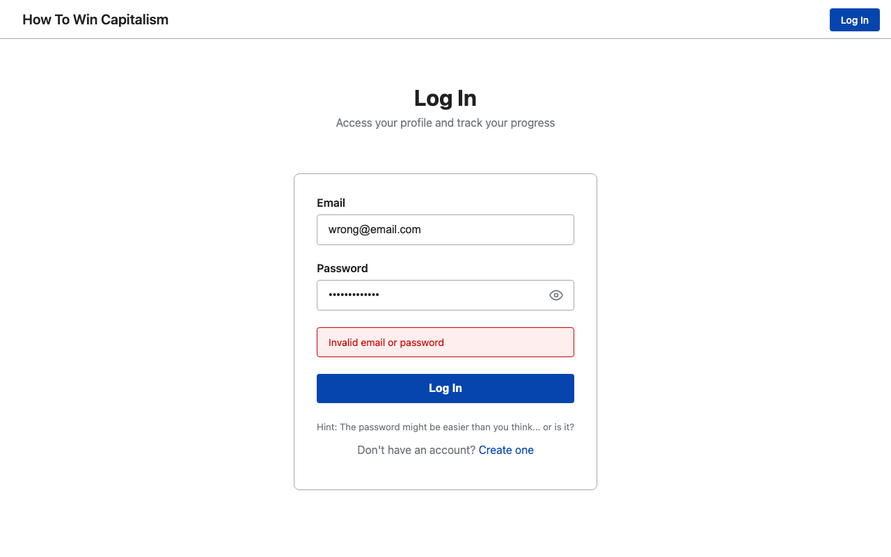
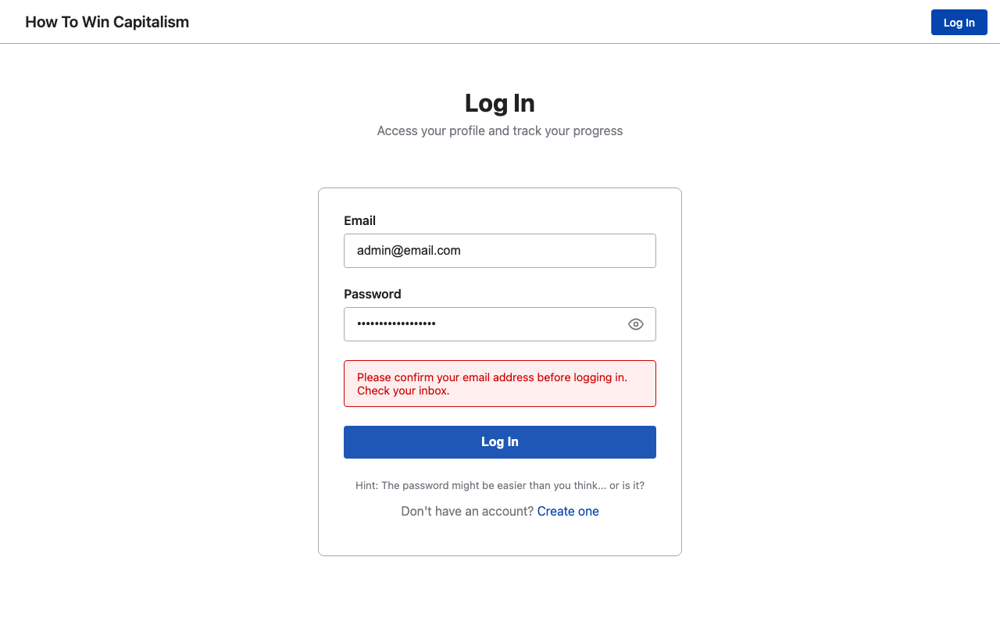
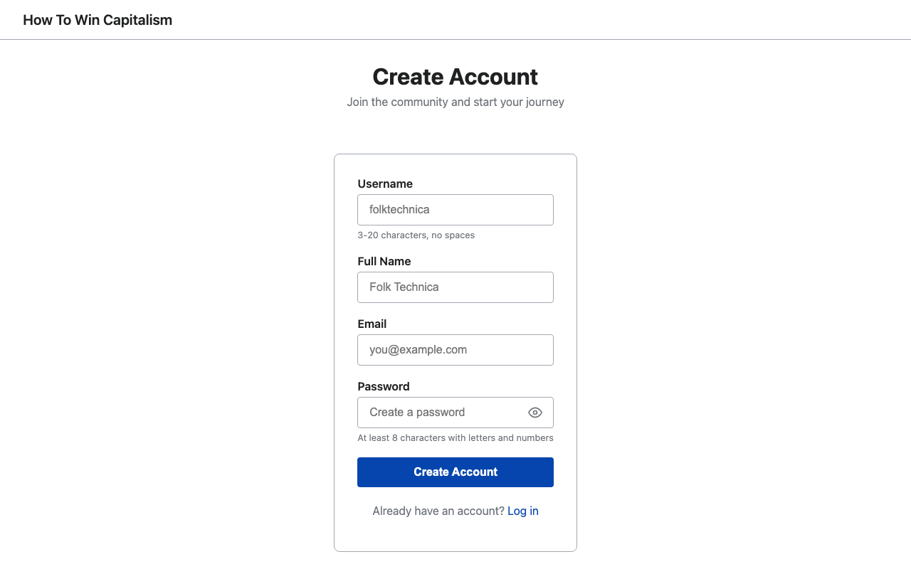

# V0.0.1 Snapshot - Authentication Flow Documentation

> **Date:** December 12, 2025
> **Version:** 0.0.1 (Pre-MVP)
> **Status:** ⚠️ Development - Not Production Ready

## Overview

This document captures the current state of the authentication system as a baseline before progressing to v0.1.0 (full MVP). Screenshots and feature inventory are included.

---

## Screenshots Gallery

All screenshots captured from production: `https://howtowincapitalism.com`

| # | Screenshot | Description | Status |
|---|------------|-------------|--------|
| 01 |  | Login form with email/password fields | ✅ Working |
| 02 |  | Invalid credentials error message | ⚠️ Returns 401 |
| 03 |  | Home page after successful login | ✅ Working |
| 04 |  | Logged-in state with user dropdown | ✅ Working |
| 05 |  | User profile view | ✅ Working |
| 06 |  | Home page authenticated state | ✅ Working |
| 07 |  | User registration form | ✅ Working |
| 08 | Forgot Password | Password reset request page | ❌ Redirect Loop |
| 09 | Logout | Post-logout redirect | ⚠️ Not Captured |

---

## Feature Inventory

### ✅ Working Features (v0.0.1)

| Feature | Implementation | Notes |
|---------|----------------|-------|
| **Login** | POST /api/auth/login | Email + password validation |
| **Logout** | POST /api/auth/logout | Session cleanup, cookie clear |
| **Registration** | POST /api/auth/register | Form validation, email confirmation sent |
| **Session Management** | Cloudflare KV + httpOnly cookies | 7-day TTL |
| **RBAC** | 4 roles (admin, editor, contributor, viewer) | Permission matrix enforced |
| **Profile View** | /users/[id]/ | Public/private data filtering |
| **Profile Edit** | /profile/edit/ | Owner-only editing |
| **Route Protection** | Middleware redirect to /login/ | Unauthenticated users blocked |
| **Password Visibility Toggle** | Show/hide password in forms | UX enhancement |

### ⚠️ Partial/Incomplete Features

| Feature | Status | Issue |
|---------|--------|-------|
| **Login** | Returns 401 | Test credentials not seeded in production KV |
| **Forgot Password** | Redirect loop | Route exists but malfunctioning |
| **Email Confirmation** | Backend ready | Needs real email testing |
| **User Menu Dropdown** | UI exists | Click behavior needs verification |

### 🔧 Required Action: Re-seed Production Users

The test credentials return 401 in production. Run:
```bash
npm run seed:users
```

Ensure `USERS` KV namespace is bound in Cloudflare Dashboard.

### ❌ Missing Features (Required for v0.1.0)

| Feature | Priority | GDPR? | Notes |
|---------|----------|-------|-------|
| **Account Deletion** | 🔴 Critical | ✅ Yes | User must be able to delete account |
| **Data Export** | 🔴 Critical | ✅ Yes | Download user data (GDPR Art. 20) |
| **Cookie Consent Banner** | 🔴 Critical | ✅ Yes | Required for EU compliance |
| **Privacy Policy Page** | 🔴 Critical | ✅ Yes | /privacy/ required |
| **Terms of Service** | 🟠 High | | /terms/ recommended |
| **Password Reset Flow** | 🟠 High | | Fix redirect loop |
| **Profile Picture Upload** | 🟡 Medium | | With NSFW content moderation |
| **Username Uniqueness** | 🟡 Medium | | Global check against all users |
| **Account Lockout** | 🟡 Medium | | After failed login attempts |
| **Rate Limiting** | 🟠 High | | Prevent brute force attacks |
| **CSRF Protection** | 🔴 Critical | | Encrypted tokens on forms |

---

## Compliance Audit

### GDPR Compliance

| Requirement | Status | Action Needed |
|-------------|--------|---------------|
| Right to erasure (Art. 17) | ❌ Missing | Add DELETE /api/auth/account endpoint |
| Right to data portability (Art. 20) | ❌ Missing | Add GET /api/auth/export endpoint |
| Consent for data collection | ❌ Missing | Cookie consent banner |
| Privacy policy | ❌ Missing | Create /privacy/ page |
| Data minimization | ✅ Partial | Only collect necessary fields |

### Accessibility (WCAG 2.1 AA)

| Requirement | Status | Notes |
|-------------|--------|-------|
| Color contrast (4.5:1) | ✅ Compliant | CSS variables enforce this |
| Keyboard navigation | ⚠️ Untested | Needs verification |
| Screen reader support | ⚠️ Untested | ARIA labels present but untested |
| Focus indicators | ⚠️ Untested | Needs verification |
| Form labels | ✅ Compliant | All inputs have labels |

### SEO & Crawling

| Requirement | Status | Notes |
|-------------|--------|-------|
| robots.txt | ✅ Complete | Allow all, sitemap linked |
| sitemap.xml | ✅ Generated | Auto-generated by Astro |
| Meta tags | ⚠️ Partial | Needs og:image, Twitter cards |
| Semantic HTML | ✅ Good | Proper heading hierarchy |
| HTTPS | ✅ Enforced | Cloudflare handles |

### Security Headers

| Header | Status | Value |
|--------|--------|-------|
| X-Frame-Options | ✅ | DENY |
| X-Content-Type-Options | ✅ | nosniff |
| X-XSS-Protection | ✅ | 1; mode=block |
| Content-Security-Policy | ✅ | Strict policy defined |
| Permissions-Policy | ✅ | Camera, mic, geo disabled |
| Referrer-Policy | ✅ | strict-origin-when-cross-origin |

### Cookie Security

| Attribute | Status | Notes |
|-----------|--------|-------|
| HttpOnly | ✅ | XSS protection |
| Secure | ✅ | HTTPS only |
| SameSite | ✅ | Strict - CSRF protection |
| Path | ⚠️ | Not restricted |

---

## Technical Architecture

```
User → Browser
       ↓
    Login Form (/login/)
       ↓
    POST /api/auth/login
       ↓
    Cloudflare Worker (kv-auth.ts)
       ↓
    Validate credentials against USERS KV
       ↓
    Create session in SESSIONS KV (7-day TTL)
       ↓
    Set httpOnly cookie (htwc_session)
       ↓
    Redirect to home (/)
```

---

## Test Credentials

| Role | Email | Password |
|------|-------|----------|
| Admin | admin@email.com | Adm!n_Secure_2024# |
| Editor | editor@email.com | Ed!tor_Access_2024# |
| Contributor | contributor@email.com | Contr!b_Pass_2024# |
| Viewer | viewer@email.com | V!ewer_Read_2024# |

---

## Roadmap to v0.1.0

### Phase 1: GDPR Compliance (Critical)
1. [ ] Create /privacy/ page
2. [ ] Create /terms/ page
3. [ ] Add cookie consent banner component
4. [ ] Implement DELETE /api/auth/account
5. [ ] Implement GET /api/auth/export

### Phase 2: Security Hardening
1. [ ] Fix forgot password redirect loop
2. [ ] Add CSRF tokens to all forms
3. [ ] Implement rate limiting
4. [ ] Upgrade password hashing (PBKDF2)
5. [ ] Add login history tracking

### Phase 3: User Experience
1. [ ] Profile picture upload with moderation
2. [ ] Username uniqueness validation
3. [ ] Better error messages
4. [ ] Email templates styling

### Phase 4: Testing & Verification
1. [ ] Full E2E test coverage
2. [ ] Accessibility audit (axe-core)
3. [ ] Security penetration testing
4. [ ] Performance testing

---

## Files Reference

### Screenshots Location
```
_docs/screenshots/auth-flow/v0.0.1/
├── 01-login-page.png
├── 02-login-error.png
├── 03-login-success.png
├── 04-user-menu.png
├── 05-profile-page.png
├── 06-home-logged-in.png
├── 07-register-page.png
└── debug-error.png
```

### Key Auth Files
```
src/lib/auth/
├── kv-auth.ts        # KV auth utilities
├── local-auth.ts     # Local dev fallback
├── store.ts          # Auth state
├── permissions.ts    # RBAC checks
├── api-client.ts     # Client-side API
└── csrf.ts           # CSRF utilities

src/pages/api/auth/
├── login.ts
├── logout.ts
├── register.ts
├── confirm.ts
├── me.ts
└── forgot-password.ts
```

---

## Related Documents

- [AUTH.md](../AUTH.md) - Authentication system documentation
- [ACCESSIBILITY.md](../ACCESSIBILITY.md) - Color and contrast guidelines
- [Security Audit](../../_work_efforts/10-19_development/10_active/10.10_security_audit.md) - Full audit plan
- [Registration Flow](../../_work_efforts/10-19_development/10_active/10.09_user_registration_email_confirmation.md) - Email confirmation setup

---

*Snapshot captured: December 12, 2025 11:43 PST*
*Next milestone: v0.1.0 (Full MVP with GDPR compliance)*
