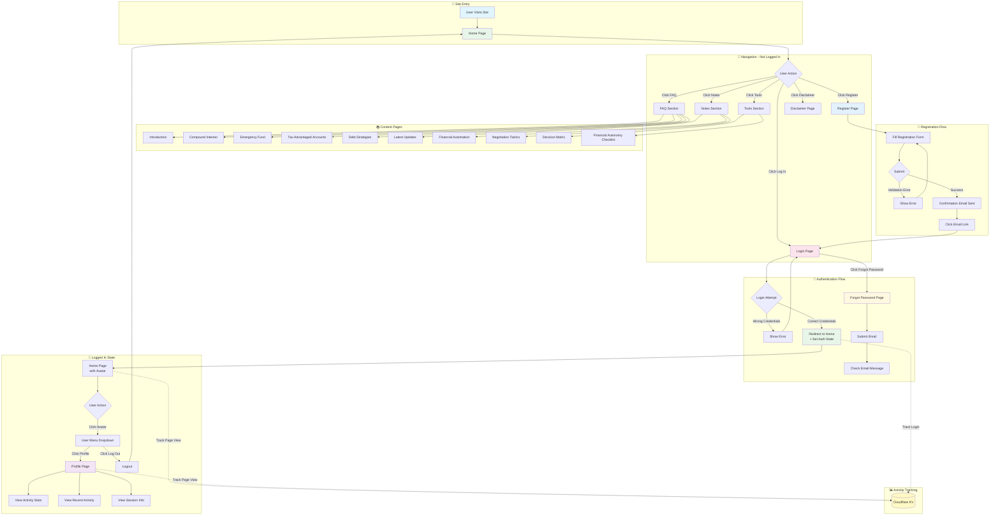
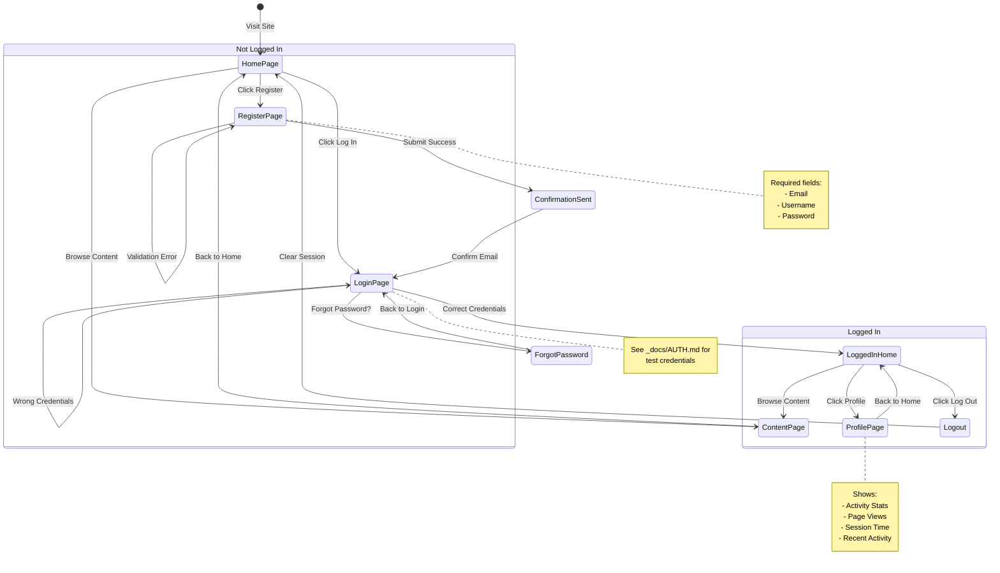
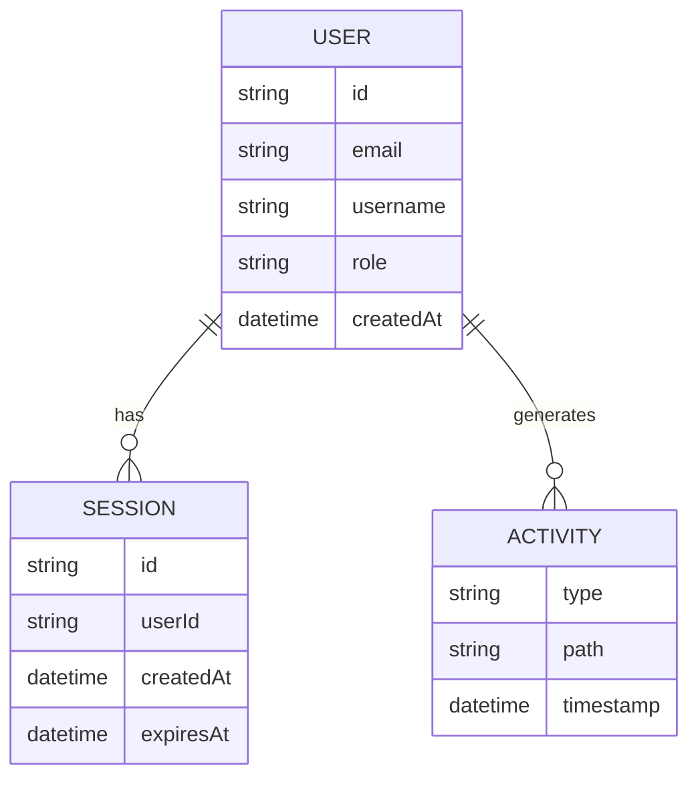

# User Flow Diagram

## How To Win Capitalism - User Journey Map

> **Version:** 0.0.1 | **Updated:** December 14, 2025

---

## Screenshots Gallery (v0.0.1)

All screenshots captured from production: `https://howtowincapitalism.com`

| # | Screenshot | Description |
|---|------------|-------------|
| 01 |  | Login form with email/password |
| 02 |  | Invalid credentials error |
| 03 |  | Home page after login |
| 04 |  | Logged-in header dropdown |
| 05 |  | User profile view |
| 06 |  | Authenticated home state |
| 07 |  | User registration form |
| 08 | Forgot Password | Password reset (⚠️ redirect loop issue) |

---

## Mermaid Flow Diagram

---

## State Diagram

---

## User Credentials Reference

See `_docs/AUTH.md` or `tests/fixtures/test-credentials.ts` for current test credentials.

| Role | Email | Notes |
|------|-------|-------|
| Admin | admin@email.com | Full access |
| Editor | editor@email.com | Content management |
| Contributor | contributor@email.com | Limited write access |
| Viewer | viewer@email.com | Read-only access |

---

## Page Inventory

| Page | URL | Auth Required | Description |
|------|-----|---------------|-------------|
| Home | `/` | No | Main landing page |
| Login | `/login/` | No | User authentication |
| Register | `/register/` | No | New user registration |
| Forgot Password | `/forgot-password/` | No | Password reset request |
| Logout | `/logout/` | No | Clears session |
| Profile | `/users/[id]/` | Yes* | User profile dashboard |
| Profile Edit | `/profile/edit/` | Yes | Edit own profile |
| FAQ | `/faq/` | No | Content section |
| Notes | `/notes/` | No | Content section |
| Tools | `/tools/` | No | Content section |
| Disclaimer | `/disclaimer/` | No | Legal disclaimer |

*Profile shows "Not Logged In" message if not authenticated

---

## Authentication Flow Details

### Login Flow
1. User navigates to `/login/`
2. Enters email and password
3. POST to `/api/auth/login`
4. Cloudflare Worker validates against `USERS` KV
5. Creates session in `SESSIONS` KV (7-day TTL)
6. Sets `httpOnly` cookie (`htwc_session`)
7. Redirects to home (`/`)

### Registration Flow
1. User navigates to `/register/`
2. Fills form (email, username, password)
3. POST to `/api/auth/register`
4. Confirmation email sent
5. User clicks email link
6. Account activated, redirected to login

### Forgot Password Flow (⚠️ Known Issue)
1. User clicks "Forgot password?" on login page
2. Navigates to `/forgot-password/`
3. ⚠️ **Current Issue:** Redirect loop in production

---

## Activity Tracking Data Model

### Activity Types
- `login` - User logged in
- `logout` - User logged out
- `pageview` - Page was visited
- `registration` - New user registered

### Storage
- **Sessions**: Cloudflare KV (`SESSIONS` namespace)
- **Users**: Cloudflare KV (`USERS` namespace)
- **Auth Cookie**: `htwc_session` (httpOnly, Secure, SameSite=Strict)

---

## Security Features (v0.0.1)

| Feature | Status | Notes |
|---------|--------|-------|
| Password hashing | ✅ | SHA-256 (upgrade to PBKDF2 planned) |
| httpOnly cookies | ✅ | XSS protection |
| Secure flag | ✅ | HTTPS only |
| SameSite=Strict | ✅ | CSRF protection |
| RBAC | ✅ | 4-role permission matrix |
| Session TTL | ✅ | 7-day expiration |
| Rate limiting | ❌ | Planned for v0.1.0 |
| CSRF tokens | ⚠️ | Partial implementation |

---

## Related Documentation

- [AUTH.md](AUTH.md) - Full authentication documentation
- [v0.0.1 Snapshot](status_reports/2025-12-12_v0.0.1-snapshot.md) - Version snapshot with compliance audit
- [SECURITY.md](technical/SECURITY.md) - Security implementation details

---

*Updated: December 14, 2025*
*Previous version: December 9, 2025*

