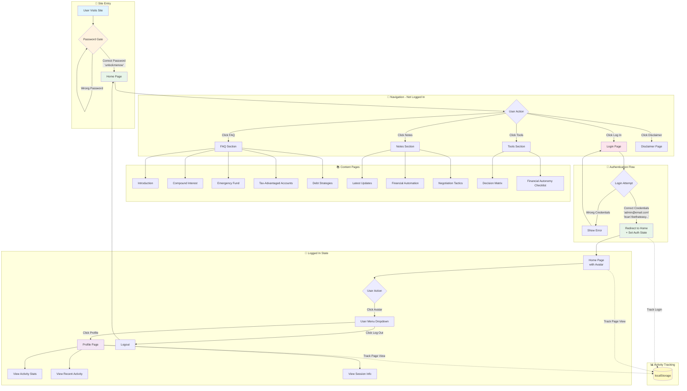
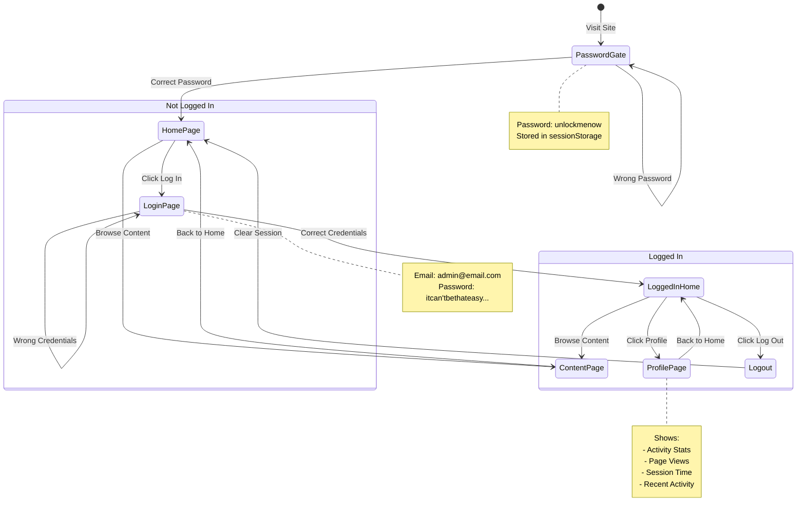
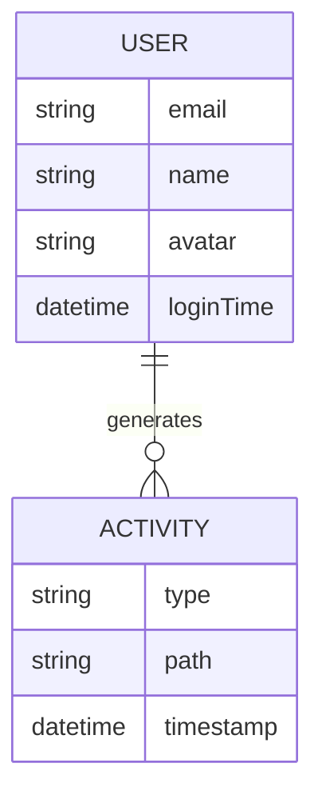

# User Flow Diagram

## How To Win Capitalism - User Journey Map

### Screenshots Captured

1. **Password Gate** - Initial site access protection
2. **Home Page** - Main landing page with navigation
3. **Login Page** - User authentication form
4. **Profile Page** - Logged-in user profile with activity tracking

---

## Mermaid Flow Diagram

---

## State Diagram

---

## User Credentials Reference

| Gate | Credential | Value |
|------|------------|-------|
| **Site Password** | Password | `unlockmenow` |
| **User Login** | Email | `admin@email.com` |
| **User Login** | Password | `itcan'tbethateasy...` |

---

## Page Inventory

| Page | URL | Auth Required | Description |
|------|-----|---------------|-------------|
| Password Gate | `/` (overlay) | No | Site-wide protection |
| Home | `/` | No | Main landing page |
| Login | `/login/` | No | User authentication |
| Logout | `/logout/` | No | Clears session |
| Profile | `/profile/` | Yes* | User activity dashboard |
| FAQ | `/faq/` | No | Content section |
| Notes | `/notes/` | No | Content section |
| Tools | `/tools/` | No | Content section |
| Disclaimer | `/disclaimer/` | No | Legal disclaimer |

*Profile shows "Not Logged In" message if not authenticated

---

## Activity Tracking Data Model

### Activity Types
- `login` - User logged in
- `logout` - User logged out
- `pageview` - Page was visited

### Storage
- **Auth State**: localStorage (`auth:isLoggedIn`, `auth:userEmail`, etc.)
- **Activity Log**: localStorage (`user_activity`)

---

*Generated: December 9, 2025*

