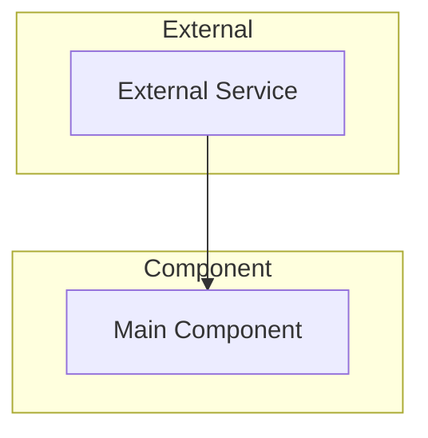

# COMPONENT PLANNING OPERATIONS MANUAL

## DOCUMENT CONTROL

| Field | Value |
|-------|-------|
| Document ID | CPO-OPS-001 |
| Version | 1.0.0 |
| Date | 2025-12-13 |
| Classification | UNCLASSIFIED |
| Purpose | Step-by-step operational procedures |

---

## 1. PURPOSE

This manual provides detailed, step-by-step procedures for executing the Component Planning Process. It is designed to be followed exactly, enabling any operator (human or AI) to produce consistent results.

---

## 2. SCOPE

This manual covers:

- Pre-operation setup
- Execution of all seven phases
- Post-operation documentation
- Troubleshooting common issues

---

## 3. PREREQUISITES

### 3.1 Required Access

| Resource | Purpose |
|----------|---------|
| Cursor IDE | Development environment |
| AI Assistant | Plan generation and critique |
| Project repository | Codebase examination |
| Write access to `_planning/` | Session documentation |
| Write access to `.cursor/plans/` | Plan storage |

### 3.2 Required Knowledge

| Topic | Level |
|-------|-------|
| Markdown formatting | Basic |
| Mermaid diagrams | Basic |
| Project structure | Familiar |
| Component patterns | Familiar |

---

## 4. PRE-OPERATION PROCEDURES

### 4.1 Procedure: Session Initialization

**Step 4.1.1:** Create session file

```bash
# Get current date
DATE=$(date +%Y-%m-%d)

# Create session file from template
cp _planning/templates/SESSION_TEMPLATE.md _planning/sessions/${DATE}_component-name.md
```

**Step 4.1.2:** Open session file in editor

**Step 4.1.3:** Fill in session header

```markdown
| Field | Value |
|-------|-------|
| Date | [TODAY'S DATE] |
| Component Name | [COMPONENT NAME] |
| Session ID | [YYYYMMDD-001] |
| Status | [x] In Progress / [ ] Complete |
```

**Step 4.1.4:** Verify AI is in appropriate mode

- For planning: Plan mode or Ask mode
- AI should NOT be in Agent mode during planning

### 4.2 Procedure: Environment Verification

**Step 4.2.1:** Verify project files are accessible

```bash
ls -la package.json
ls -la src/components/
ls -la .cursorrules
```

**Step 4.2.2:** Verify planning folders exist

```bash
ls -la _planning/
ls -la _planning/templates/
ls -la _planning/sessions/
ls -la .cursor/plans/
```

**Step 4.2.3:** If folders missing, create them

```bash
mkdir -p _planning/templates _planning/sessions .cursor/plans
```

---

## 5. PHASE EXECUTION PROCEDURES

### 5.1 Phase I: Requirements Gathering

#### Procedure 5.1.1: Initial Request

**Step 1:** User states requirement

**Step 2:** AI echoes understanding

Example AI response:
```
"My understanding is that you want [X] that does [Y] with [Z] capability.
Is this correct?"
```

**Step 3:** User confirms or corrects

**Step 4:** Proceed to clarifying questions

#### Procedure 5.1.2: Clarifying Questions

**Step 1:** AI asks focused questions

Standard questions to ask:
- What data should be displayed?
- What data should be collected?
- How should errors be handled?
- What are the security requirements?
- What display modes are needed?

**Step 2:** User provides answers

**Step 3:** Document in session file

```markdown
### 1.3 Clarifying Questions Asked

| Question | User Response |
|----------|---------------|
| What data to display? | [ANSWER] |
| What to collect? | [ANSWER] |
```

#### Procedure 5.1.3: Requirements Documentation

**Step 1:** Create requirements table

```markdown
| ID | Requirement | Priority | Notes |
|----|-------------|----------|-------|
| R-001 | [Requirement text] | High | [Notes] |
| R-002 | [Requirement text] | Medium | [Notes] |
```

**Step 2:** Assign priorities

- **High:** Core functionality, must have
- **Medium:** Important but could defer
- **Low:** Nice to have

**Step 3:** User confirms requirements

**Step 4:** Mark phase complete in session file

```markdown
### 1.4 Requirements Confirmed

- [x] All requirements documented
- [x] Priorities assigned
- [x] Ambiguities resolved
```

---

### 5.2 Phase II: Technical Discovery

#### Procedure 5.2.1: Codebase Examination

**Step 1:** Identify files to examine

Priority order:
1. `package.json` — Dependencies
2. `src/components/index.ts` — Component registry
3. Similar existing components — Patterns
4. `.cursorrules` — Constraints
5. `AGENTS.md` — AI instructions

**Step 2:** Read each file

**Step 3:** Document findings

```markdown
### 2.1 Codebase Files Examined

| File | Purpose | Key Findings |
|------|---------|--------------|
| package.json | Dependencies | Has Astro, nanostores |
| WikiBox.astro | Base component | Uses BEM, CSS vars |
```

#### Procedure 5.2.2: Constraint Documentation

**Step 1:** Identify technical constraints

Sources:
- `.cursorrules`
- `AGENTS.md`
- `package.json` (missing dependencies)
- Hosting platform limitations

**Step 2:** Document constraints

```markdown
### 2.2 Technical Constraints

| Constraint | Source | Impact on Design |
|------------|--------|------------------|
| No React | .cursorrules | Use vanilla JS |
| Use CSS vars | .cursorrules | No hardcoded colors |
```

**Step 3:** Mark phase complete

---

### 5.3 Phase III: Architecture Selection

#### Procedure 5.3.1: Option Generation

**Step 1:** Generate minimum 3 architectural options

**Step 2:** For each option, document:

```markdown
#### Option A: [Name]

**Description:** [One paragraph explaining the approach]

**Pros:**
- [Advantage 1]
- [Advantage 2]

**Cons:**
- [Disadvantage 1]
- [Disadvantage 2]
```

**Step 3:** Identify any requirement tensions

Example:
```
"You've asked for [X] AND [Y], but these are in tension.
X requires [approach], but Y requires [different approach].
Which should we prioritize?"
```

#### Procedure 5.3.2: User Selection

**Step 1:** Present all options clearly

**Step 2:** Explain tradeoffs

**Step 3:** Ask for selection

```
"Which option would you like to proceed with: A, B, or C?"
```

**Step 4:** Document selection

```markdown
### 3.2 User Selection

**Selected Option:** [A/B/C]

**Rationale:** [Why this option was chosen]
```

**Step 5:** Add to decision log

```markdown
## Decision Log

| ID | Decision | Rationale | Alternatives Rejected |
|----|----------|-----------|----------------------|
| D-001 | Use Option A | [Rationale] | B (too complex), C (missing feature) |
```

---

### 5.4 Phase IV: Plan Formulation

#### Procedure 5.4.1: Create Plan Document

**Step 1:** Create plan file

Location: `.cursor/plans/[component]_[hash].plan.md`

**Step 2:** Add frontmatter

```yaml
---
name: [Component Name]
overview: [One sentence description]
todos:
  - id: todo-1
    content: [Task description]
    status: pending
---
```

#### Procedure 5.4.2: Add Architecture Diagram

**Step 1:** Create mermaid diagram

```markdown
## Architecture


```

**Step 2:** Add data flow diagram if applicable

**Step 3:** Add component structure diagram if complex

#### Procedure 5.4.3: Document File Structure

```markdown
## File Structure

```
src/components/[name]/
  [Name].astro           # Main component
```
```

#### Procedure 5.4.4: Write Component Code

**Step 1:** Include full implementation

```markdown
## Component Code

```astro
---
// Full component code here
---

<div class="component">
  <!-- Template -->
</div>

<style>
  /* Styles */
</style>
```
```

#### Procedure 5.4.5: Add Security Section

```markdown
## Security

| Concern | Mitigation |
|---------|------------|
| [Threat] | [How addressed] |
```

#### Procedure 5.4.6: Define Todos

```markdown
## Todos

- [ ] Create component file
- [ ] Add to registry
- [ ] Test functionality
```

---

### 5.5 Phase V: Critical Review

#### Procedure 5.5.1: Execute Self-Critique

**Step 1:** Use the critique prompt

```
Now harshly criticize your plan. Disprove yourself if you can.
```

**Step 2:** Document all flaws found

```markdown
### 5.2 Flaws Identified

| Flaw ID | Description | Severity | Resolution |
|---------|-------------|----------|------------|
| F-001 | Over-engineered | High | Simplify |
| F-002 | Missing error handling | Medium | Add try/catch |
```

#### Procedure 5.5.2: Severity Classification

| Severity | Criteria | Action Required |
|----------|----------|-----------------|
| CRITICAL | Violates core requirement, security hole | Must fix |
| HIGH | Significant over-engineering | Should fix |
| MEDIUM | Unnecessary complexity | Consider fixing |
| LOW | Minor improvements | Optional |

#### Procedure 5.5.3: Requirement Alignment Check

**Step 1:** For each requirement, verify plan addresses it

```markdown
### 5.3 Alignment Check

| Original Requirement | Plan Addresses It? | Notes |
|---------------------|-------------------|-------|
| R-001: [Text] | [x] Yes | |
| R-002: [Text] | [ ] Partial | Missing X |
```

**Step 2:** If any not addressed, document as flaw

---

### 5.6 Phase VI: Plan Revision

#### Procedure 5.6.1: Address Flaws

**Step 1:** Start with CRITICAL flaws

**Step 2:** Address HIGH flaws

**Step 3:** Document changes

```markdown
### 6.1 Changes Made

| Change | Reason |
|--------|--------|
| Removed X | Over-engineered (F-001) |
| Added Y | Missing requirement (F-002) |
```

#### Procedure 5.6.2: Second Critique

**Step 1:** Use the second critique prompt

```
Now criticize this NEW plan just as harshly. Does it align with my original goals?
```

**Step 2:** Document any new flaws

**Step 3:** Repeat revision if CRITICAL/HIGH flaws found

#### Procedure 5.6.3: Exit Criteria

The revision loop exits when:
- No CRITICAL flaws remain
- No HIGH flaws remain (or explicitly accepted by user)
- Requirement alignment verified

---

### 5.7 Phase VII: Final Approval

#### Procedure 5.7.1: Present Summary

**Step 1:** Create summary table

```markdown
## Final Summary

| Aspect | Detail |
|--------|--------|
| Architecture | [Brief description] |
| Files | [List of files] |
| Key Decisions | [Main decisions] |
```

#### Procedure 5.7.2: Request Approval

**Step 1:** Ask explicitly

```
"The plan is ready. Would you like to approve it and proceed with implementation?"
```

**Step 2:** Wait for explicit approval

Approval indicators:
- "Yes"
- "Approved"
- "Let's build it"
- Mode switch to Agent

#### Procedure 5.7.3: Document Approval

```markdown
### 7.2 User Approval

- [x] User reviewed final plan
- [x] User approved for implementation
- [x] Mode switched to Agent
```

---

## 6. POST-OPERATION PROCEDURES

### 6.1 Session Completion

**Step 1:** Mark session complete

```markdown
| Status | [x] Complete |
```

**Step 2:** Fill in any remaining sections

**Step 3:** Add session notes and learnings

### 6.2 Documentation Update

**Step 1:** Update devlog

```bash
# Add entry to today's devlog
echo "## Component Planning: [Name]" >> _docs/devlog/$(date +%Y-%m-%d)_devlog.md
```

**Step 2:** Commit planning documents

```bash
git add _planning/ .cursor/plans/
git commit -m "docs: complete planning session for [component-name]"
```

---

## 7. TROUBLESHOOTING

### 7.1 Common Issues

#### Issue: Requirements keep changing

**Cause:** Incomplete Phase I

**Solution:**
1. Return to Phase I
2. Ask more clarifying questions
3. Document all requirements before proceeding

#### Issue: Can't find existing patterns

**Cause:** Insufficient Phase II

**Solution:**
1. Search for similar components
2. Check `src/components/` directory
3. Look at external examples if needed

#### Issue: No good architectural options

**Cause:** Over-constrained requirements

**Solution:**
1. Identify conflicting requirements
2. Present tension to user
3. Ask user to prioritize

#### Issue: Critique finds only minor flaws

**Cause:** Possible confirmation bias

**Solution:**
1. Use critique checklist explicitly
2. Check each category
3. Ask "What could go wrong?"

#### Issue: User won't approve

**Cause:** Unaddressed concerns

**Solution:**
1. Ask what concerns remain
2. Document additional requirements
3. Revise plan to address

### 7.2 Recovery Procedures

#### Recovery: Return to Previous Phase

If current phase cannot complete:

1. Document the blocker
2. Identify which previous phase needs revision
3. Return to that phase
4. Re-execute from there

#### Recovery: Session Restart

If session is fundamentally broken:

1. Archive current session file
2. Create new session file
3. Start from Phase I
4. Reference previous session for context

---

## 8. REFERENCE MATERIALS

### 8.1 Key Prompts (Copy-Paste Ready)

#### Initial Request Prompt
```
I need to plan a new component. Here's what I want:

[DESCRIBE COMPONENT]

Before we start building, I want to go through a structured planning process.
Please start by echoing back your understanding, then ask clarifying questions.
```

#### Simplicity Constraint Prompt
```
I want this to be as simple and secure as possible. What's the dumbest, simplest, most safe way to do this?
```

#### Primary Critique Prompt
```
Now harshly criticize your plan. Disprove yourself if you can.
```

#### Second Critique Prompt
```
Now criticize this NEW plan just as harshly. Does it align with my original goals?
```

#### Approval Request Prompt
```
Summarize the final plan. What are we building, what files, what's the architecture?
```

### 8.2 Checklists

#### Pre-Session Checklist
- [ ] Session file created from template
- [ ] AI in Plan mode
- [ ] Project files accessible
- [ ] User has initial requirement ready

#### Post-Session Checklist
- [ ] Session file completed
- [ ] Plan document at `.cursor/plans/`
- [ ] All decisions documented
- [ ] User approval recorded
- [ ] Changes committed to git

### 8.3 Templates Location

| Template | Path |
|----------|------|
| Session | `_planning/templates/SESSION_TEMPLATE.md` |
| Prompts | `_planning/templates/PROMPTS.md` |
| Critique | `_planning/templates/CRITIQUE_CHECKLIST.md` |
| Plan | `_planning/templates/PLAN_TEMPLATE.md` |

---

## 9. REVISION HISTORY

| Version | Date | Author | Changes |
|---------|------|--------|---------|
| 1.0.0 | 2025-12-13 | AI Planning System | Initial release |

---

**END OF OPERATIONS MANUAL**
