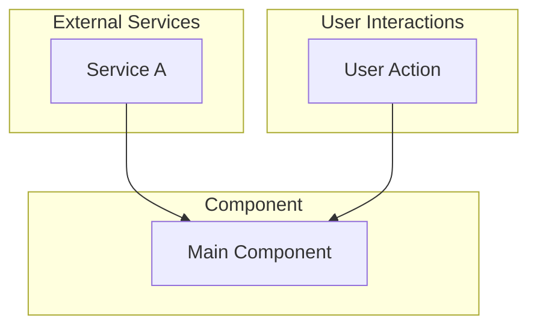
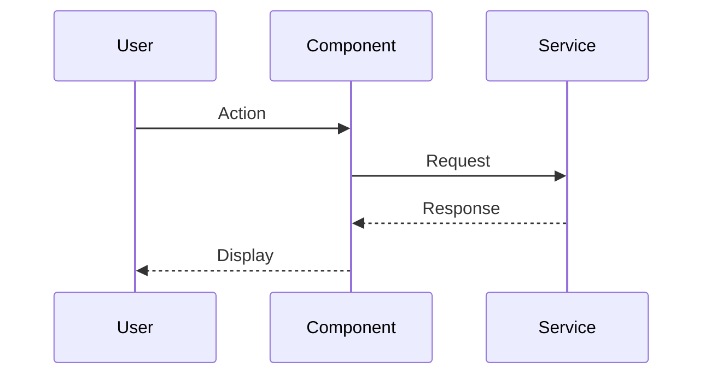

# [Component Name] Plan

## Document Information

| Field | Value |
|-------|-------|
| Plan ID | [AUTO-GENERATED] |
| Component | [Name] |
| Created | YYYY-MM-DD |
| Status | Draft / Approved / Implemented |

---

## Overview

[One paragraph describing what this component does and why it exists]

---

## Architecture

### System Diagram



### Data Flow



---

## File Structure

```
src/components/[name]/
  [Name].astro           # Main component
  [supporting files]
```

---

## Data Structures

### [Structure Name]

```typescript
interface Example {
  field1: string;
  field2: number;
}
```

---

## Component Code

### [FileName].astro

```astro
---
/**
 * [COMPONENT NAME]
 *
 * [Description]
 */

export interface Props {
  // props
}

const { } = Astro.props;
---

<div class="component">
  <!-- template -->
</div>

<style>
  .component {
    /* styles */
  }
</style>
```

---

## Usage

```astro
---
import Component from '../components/[name]/Component.astro';
---

<Component />
```

---

## Configuration

| Option | Type | Default | Description |
|--------|------|---------|-------------|
| | | | |

---

## Security

| Concern | Mitigation |
|---------|------------|
| | |

---

## Accessibility

| Requirement | Implementation |
|-------------|----------------|
| Keyboard navigation | |
| Screen reader | |
| Color contrast | |

---

## To Update

1. Step one
2. Step two
3. Step three

---

## Future Enhancements

| Feature | Add When | Complexity |
|---------|----------|------------|
| | | Low/Medium/High |

---

## What We're NOT Building

- Item 1
- Item 2

---

## Todos

- [ ] Todo 1
- [ ] Todo 2
- [ ] Todo 3
